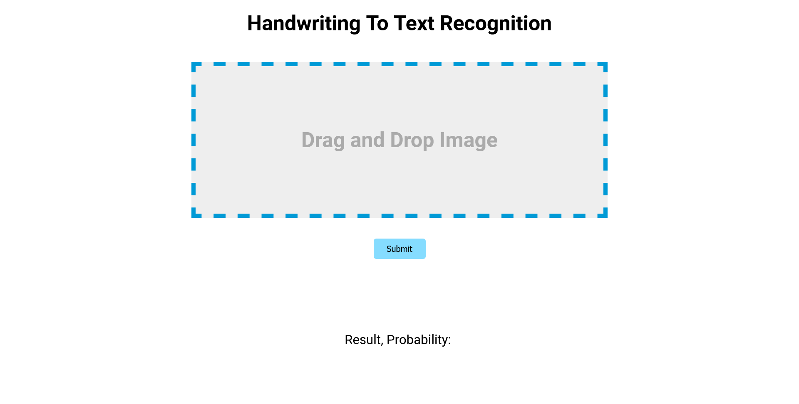

# Handwriting to Text Recognition

TensorFlow (TF)-based Handwritten Text Recognition (HTR) system developed, trained using IAM off-line HTR dataset. The model outputs the identified text after receiving images of single words or text lines (many words) as input. Character error rate is 10%, and 3/4 of the words in the validation-set are correctly identified.

# Screenshots

